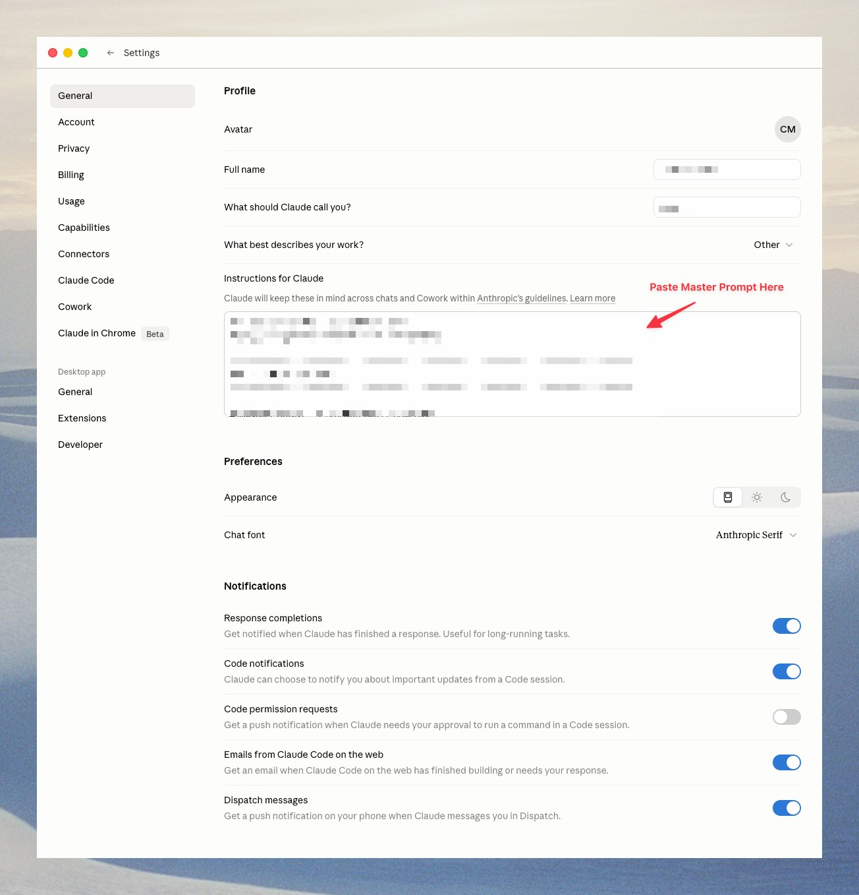

# Master Prompt for Claude Code

A Claude Code skill that builds, installs, and maintains your personal Master Prompt through a guided interview.

## What's a Master Prompt?

A Master Prompt is a set of persistent instructions that tells Claude who you are, what you do, how you work, and how you want it to respond. Instead of re-explaining yourself every conversation, Claude starts every session already knowing your context.

## What This Does

- **First run:** Walks you through a friendly interview (one question at a time), builds a personalized Master Prompt, installs it into Claude Code, and exports a copy to your Desktop for pasting into other AI tools.
- **After that:** Say `/master-prompt` anytime to update it. Changes automatically sync to both Claude Code and the Desktop export.

## Installation

Copy the skill into your Claude Code skills directory:

```bash
git clone https://github.com/codacolor/master-prompt.git ~/.claude/skills/master-prompt
```

That's it. Open Claude Code and type:

```
/master-prompt
```

Follow the prompts. It takes about 5-10 minutes.

## What Gets Installed

| File | Purpose |
|------|---------|
| `~/.claude/CLAUDE.md` | Your Master Prompt — loaded into every Claude Code conversation automatically |
| `~/Desktop/Master_Prompt_Baked.txt` | A copy for pasting into the Claude desktop app, OpenAI Codex CLI, or any other AI tool that supports custom instructions |

## Example: What a Finished Master Prompt Looks Like

Once installed, the section between `<!-- MASTER_PROMPT_START -->` and `<!-- MASTER_PROMPT_END -->` in `~/.claude/CLAUDE.md` will look something like this. Yours will adapt to your role, business stage, and response preferences.

<details>
<summary>Click to expand a sample Master Prompt</summary>

```
<!-- MASTER_PROMPT_START -->
# MASTER PROMPT

## 1. PERSONAL
Name: Jane Smith
Role: Independent product designer
How I want to use AI: Strategy thinking, writing copy, reviewing code, pushing back on weak ideas
Strengths: Visual design, user research, plain-English writing
Weaknesses / Constraints: New to backend code, easily overwhelmed by long lists

## 2. COMPANY / ORGANIZATION
Name: Solo / freelance
Established: 2022
Team: Just me, plus contractors as needed
Market served: Early-stage SaaS founders building their first product
Ideal customer: Pre-Series A founders with technical co-founders but no design lead
Outcome delivered: Product UX that converts trial users to paid
Differentiators: Strategic design lens, not pixel-pushing

## 3. PRODUCTS & SERVICES
- 4-week design sprint engagements: $12K
- Monthly design retainer: $6K/mo
- One-day audit workshops: $2.5K

## 4. CULTURE & MISSION
Core values: Honesty over politeness, evidence over taste, ship over polish
Mission: Help founders ship products their users actually want
BHAG: Be the design partner founders text first when something feels off

## 5. RESPONSE PREFERENCES
- Lead with the recommendation, then the reasoning
- If I'm wrong about something, tell me directly — don't hedge
- No emojis, no exclamation points
- Keep responses under 200 words unless I ask for depth
- Push back on weak ideas instead of agreeing politely
<!-- MASTER_PROMPT_END -->
```

</details>

The interview adapts: if you're not running a company, sections 2–4 condense or get skipped entirely.

## Using It With Other AI Tools

Your Master Prompt also lives at `~/Desktop/Master_Prompt_Baked.txt` — paste it into any AI tool's "custom instructions" field.

### Claude Desktop App

1. Open Claude Desktop and go to **Settings → General** (left sidebar)
2. Scroll down to the **Profile** section
3. Find the field labeled **"Instructions for Claude"**
4. Paste the contents of `Master_Prompt_Baked.txt` into that box
5. Close Settings — changes save automatically

> Claude will use these instructions across all your chats and Cowork sessions within Anthropic's guidelines.



### OpenAI Codex CLI

> The consumer ChatGPT app caps custom instructions to a short field — too small to hold a full Master Prompt. **Codex CLI is the right OpenAI surface for this** — it reads a full markdown file at session start.


Codex reads custom instructions from `~/.codex/AGENTS.md` automatically on every session. Copy your baked prompt there:


```bash
mkdir -p ~/.codex
cp ~/Desktop/Master_Prompt_Baked.txt ~/.codex/AGENTS.md
```

Every Codex session will now start with your context loaded.

### Cursor, Windsurf, Gemini, GitHub Copilot

Most AI tools have a "system prompt" or "custom instructions" field somewhere in settings. The Master Prompt format is plain markdown — it works in any tool that accepts free-form text instructions.

| Tool | Where to paste |
|------|----------------|
| **Cursor** | Settings → Rules for AI |
| **Windsurf** | Settings → Custom Instructions |
| **Google Gemini** | Settings → Saved Info / Personalization |
| **GitHub Copilot** | Repo-level: `.github/copilot-instructions.md` |

Open `Master_Prompt_Baked.txt`, copy everything, paste, save.

## Updating Your Master Prompt

Say `/master-prompt` in any Claude Code conversation and describe what changed. The skill walks you through edits one at a time and re-exports everything.

You can also edit `~/.claude/CLAUDE.md` directly in any text editor.

## How It Works

The skill has three modes:

1. **Setup** — Detected automatically when no master prompt exists. Runs the full interview.
2. **Update** — When you already have a master prompt and want to change something.
3. **Bake** — Just re-exports to Desktop without making changes. Say "bake master prompt".

## Troubleshooting

**The skill didn't trigger when I typed `/master-prompt`.**
The skill needs to live at `~/.claude/skills/master-prompt/`. Verify with `ls ~/.claude/skills/master-prompt/SKILL.md` — if you see "no such file," re-run the install:
```bash
git clone https://github.com/codacolor/master-prompt.git ~/.claude/skills/master-prompt
```

**`bake.py` fails with "Master prompt markers not found."**
`~/.claude/CLAUDE.md` exists but doesn't contain the `<!-- MASTER_PROMPT_START -->` and `<!-- MASTER_PROMPT_END -->` markers. Open `~/.claude/CLAUDE.md` and check the markers are present and spelled correctly. If you manually edited the file and removed them, either restore them or re-run `/master-prompt` to rebuild.

**`python3` not found.**
Install Python 3 from [python.org](https://www.python.org/downloads/) or via Homebrew: `brew install python3`. The bake script needs Python 3.6+.

**My existing `~/.claude/CLAUDE.md` content got overwritten.**
The skill prepends the Master Prompt *above* existing content separated by a `---`. If something got lost, check your editor's local history or Time Machine. Going forward, the skill only edits between the `MASTER_PROMPT_START`/`END` markers, so you can edit the rest of `~/.claude/CLAUDE.md` freely.
